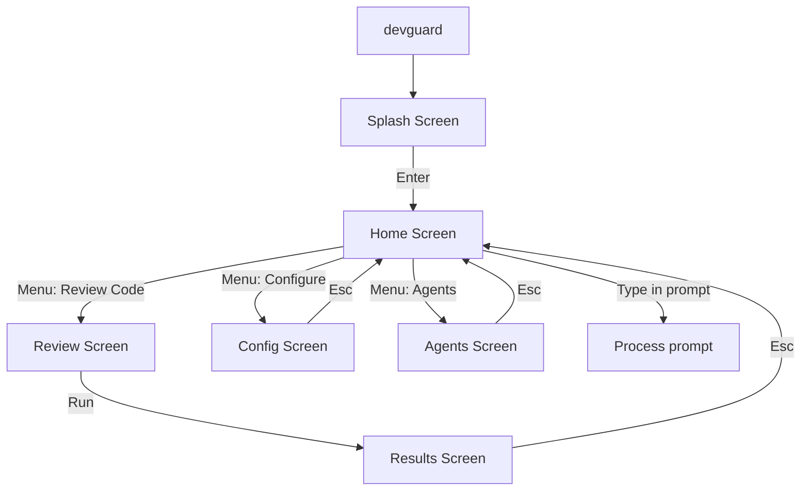

# DevGuard — AI-Powered Code Review CLI

Build a globally-installable CLI tool with a **full-screen interactive TUI** (like Claude Code / Gemini CLI). Typing `devguard` opens an immersive terminal experience with ASCII art splash, interactive prompt, menu navigation, and AI-powered code review.

**AI Providers:** Claude (Anthropic), Gemini (Google), Groq  
**Stack:** TypeScript · ESM · Ink (React TUI) · LangChain · Commander.js · Vitest

---

## User Review Required

> [!IMPORTANT]
> The TUI is the **primary interface**. Running `devguard` with no args launches the full-screen TUI. CLI flags (`devguard review --json`) bypass the TUI for CI/scripting use.

> [!IMPORTANT]
> Using **Ink** (React for CLIs) for the TUI layer — it's the de facto standard for building rich terminal UIs in Node.js, used by Vercel, Gatsby, and others.

---

## Proposed Changes

### Project Bootstrap

#### [NEW] [package.json](file:///Users/tushar/Documents/code/devgauard/package.json)
- ESM (`"type": "module"`), bin: `devguard → dist/cli/index.js`
- Runtime: `ink`, `ink-text-input`, `ink-select-input`, `ink-spinner`, `ink-gradient`, `ink-big-text`, `react`, `langchain`, `@langchain/anthropic`, `@langchain/google-genai`, `@langchain/groq`, `commander`, `simple-git`, `chalk`, `cli-table3`, `p-map`, `zod`, `figlet`
- Dev: `typescript`, `vitest`, `tsx`, `@types/node`, `@types/react`

#### [NEW] [tsconfig.json](file:///Users/tushar/Documents/code/devgauard/tsconfig.json)
- `"module": "NodeNext"`, strict, `outDir: "dist/"`, `"jsx": "react-jsx"`

---

### TUI Layer — `src/tui/` ⭐ NEW

This is the **hero experience** — what users see when they type `devguard`.

#### [NEW] [src/tui/index.tsx](file:///Users/tushar/Documents/code/devgauard/src/tui/index.tsx)
Entry point. Renders `<App />` via Ink's `render()`.

#### [NEW] [src/tui/App.tsx](file:///Users/tushar/Documents/code/devgauard/src/tui/App.tsx)
Root component. Manages screen routing via state:
- `splash` → `home` → `review` / `agents` / `config` / `results`
- Global keyboard handler: `Esc` = back, `q` = quit, `Ctrl+?` = help overlay

#### Screens

| File | What it shows |
|------|--------------|
| `SplashScreen.tsx` | ASCII art "DEVGUARD" banner (figlet), welcome message, "Press Enter to continue" |
| `HomeScreen.tsx` | Tips section + interactive `>` prompt input (like Gemini CLI) + main menu |
| `ReviewScreen.tsx` | Review config form → triggers agent pipeline → redirects to results |
| `AgentsScreen.tsx` | Toggle agents on/off with checkboxes |
| `ConfigScreen.tsx` | View/edit `.devguardrc` settings |
| `ResultsScreen.tsx` | Scrollable findings grouped by file, severity badges, expand/collapse |
| `HelpOverlay.tsx` | Keybinding reference overlay (Ctrl+?) |

#### Components

| File | Purpose |
|------|---------|
| `Header.tsx` | Branded top bar with "DevGuard" + version |
| `StatusBar.tsx` | Bottom bar: CWD, active model, mode indicator (like Gemini CLI) |
| `Prompt.tsx` | `>` input prompt with placeholder text |
| `FindingCard.tsx` | Single finding with severity color badge |
| `Spinner.tsx` | Animated spinner during LLM calls |
| `MenuItem.tsx` | Selectable menu item with icon + description |
| `Menu.tsx` | Vertical menu with arrow-key navigation |

---

### Config — `src/config/`

#### [NEW] [schema.ts](file:///Users/tushar/Documents/code/devgauard/src/config/schema.ts)
Zod schema for `.devguardrc`:
```ts
{ provider, model, agents, exclude, maxFileSizeKB, customRules }
```

#### [NEW] [loader.ts](file:///Users/tushar/Documents/code/devgauard/src/config/loader.ts)
Finds `.devguardrc` in CWD, validates with Zod, merges env vars.

---

### Git Module — `src/git/`

#### [NEW] [diff.ts](file:///Users/tushar/Documents/code/devgauard/src/git/diff.ts)
`simple-git` wrapper: `git diff HEAD`, `--staged`, `--branch <name>`. Returns parsed hunks filtered to JS/TS.

---

### Chunking — `src/chunker/`

#### [NEW] [index.ts](file:///Users/tushar/Documents/code/devgauard/src/chunker/index.ts)
LangChain `RecursiveCharacterTextSplitter` (chunkSize: 3000, overlap: 200).

---

### Security — `src/security/`

#### [NEW] [redact.ts](file:///Users/tushar/Documents/code/devgauard/src/security/redact.ts)
Regex scanner: replaces API keys / passwords / tokens with `[REDACTED]`.

---

### AI Providers — `src/providers/`

| File | Provider | Default models |
|------|----------|---------------|
| `anthropic.ts` | Claude | `claude-sonnet-4-5`, `claude-haiku-3-5` |
| `gemini.ts` | Gemini | `gemini-2.0-flash`, `gemini-1.5-pro` |
| `groq.ts` | Groq (default) | `llama-3.3-70b-versatile`, `mixtral-8x7b-32768` |
| `index.ts` | Factory | Reads config → returns `BaseChatModel` |

---

### Review Agents — `src/agents/`

#### [NEW] [types.ts](file:///Users/tushar/Documents/code/devgauard/src/agents/types.ts)
`Finding { file, line, severity, agent, message, suggestion }`

#### [NEW] [base.ts](file:///Users/tushar/Documents/code/devgauard/src/agents/base.ts)
`createAgentChain(llm, systemPrompt)` → `ChatPromptTemplate` + `StructuredOutputParser`

#### Agent files
| File | Focus |
|------|-------|
| `bug-hunter.ts` | Logic errors, null derefs, off-by-one |
| `security-scan.ts` | OWASP Top 10, injections, secrets |
| `performance-check.ts` | N+1 queries, memory leaks |
| `style-guide.ts` | Naming, dead code, complexity |
| `test-coverage.ts` | Missing tests, weak assertions |

#### [NEW] [runner.ts](file:///Users/tushar/Documents/code/devgauard/src/agents/runner.ts)
`p-map(concurrency: 3)`, deduplicates by `(file, line, message)`.

---

### Output — `src/output/`

| File | Format |
|------|--------|
| `terminal.ts` | chalk + cli-table3, grouped by file/severity |
| `json.ts` | Pretty-printed JSON |
| `sarif.ts` | SARIF 2.1.0 for CI |
| `interactive.ts` | Inquirer: "Apply fix?" prompts |

---

### CLI — `src/cli/`

#### [NEW] [index.ts](file:///Users/tushar/Documents/code/devgauard/src/cli/index.ts)
Commander.js:
- **No args** → launches TUI (`src/tui/`)
- `review` → direct review (flags: `--staged`, `--branch`, `--agent`, `--json`, `--sarif`)
- `init` → writes `.devguardrc`
- `agents` → lists available agents

#### [NEW] [init.ts](file:///Users/tushar/Documents/code/devgauard/src/cli/init.ts)
Writes default `.devguardrc` to CWD.

---

## TUI Flow



---

## Verification Plan

### Automated Tests
```bash
npx vitest run
```

| Test | Covers |
|------|--------|
| `src/git/__tests__/diff.test.ts` | diff parsing, mocks `simple-git` |
| `src/config/__tests__/loader.test.ts` | `.devguardrc` loading & validation |
| `src/chunker/__tests__/index.test.ts` | chunk splitting |
| `src/output/__tests__/json.test.ts` | JSON format |
| `src/output/__tests__/sarif.test.ts` | SARIF 2.1 structure |
| `src/security/__tests__/redact.test.ts` | secret redaction |
| `src/agents/__tests__/runner.test.ts` | dedup logic |

### Manual Verification
```bash
npm run build

# Full TUI experience:
devguard

# Direct CLI (for CI):
devguard review --json
devguard review --sarif
devguard review --agent security-scan
devguard init
```
